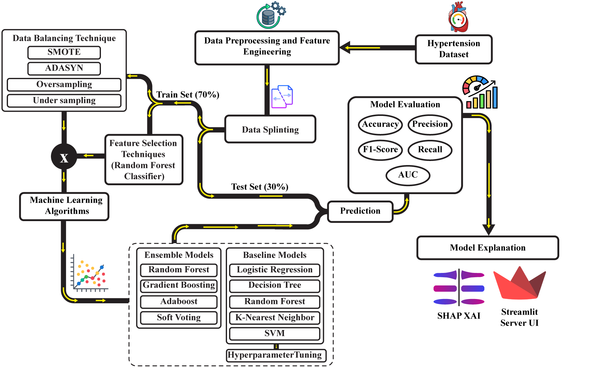
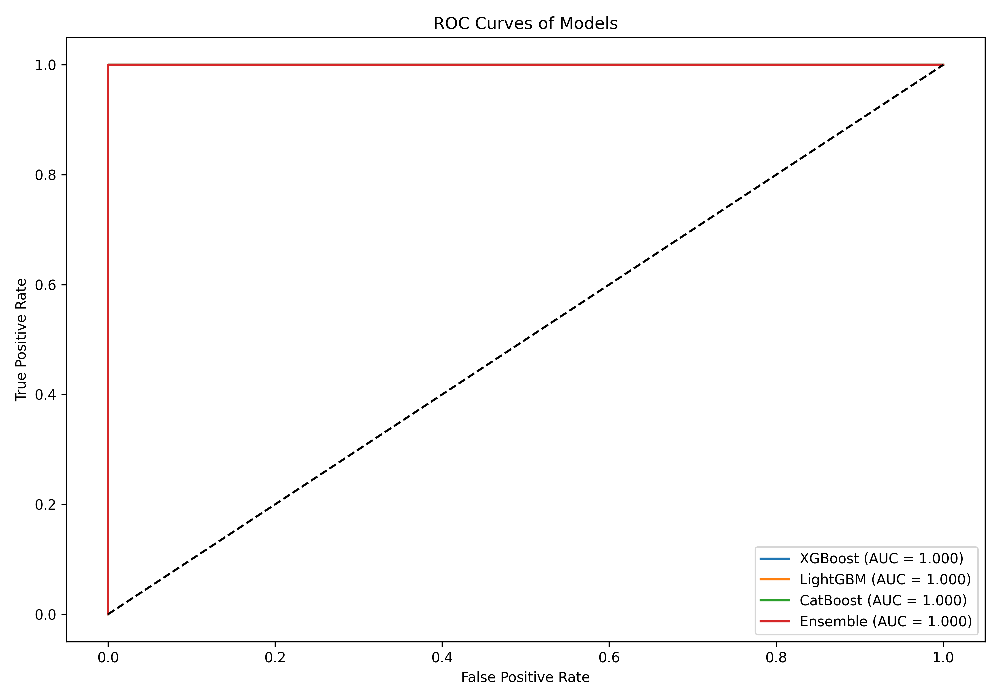
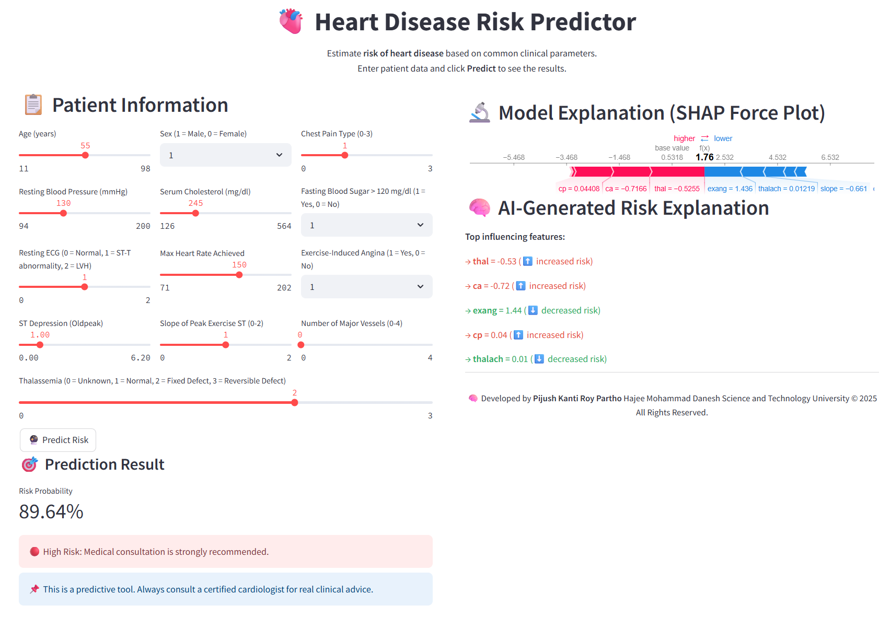
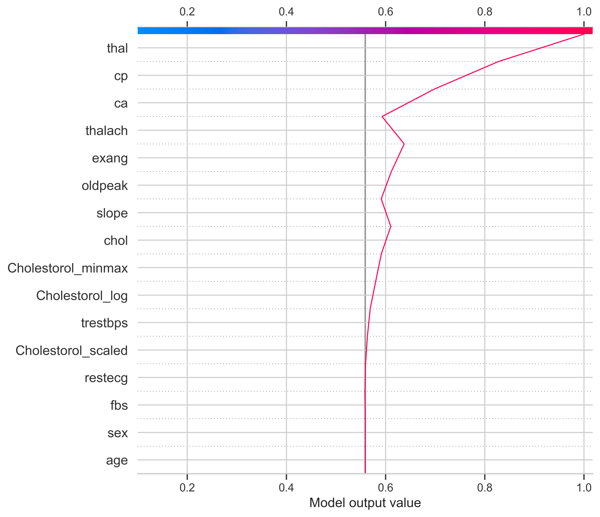
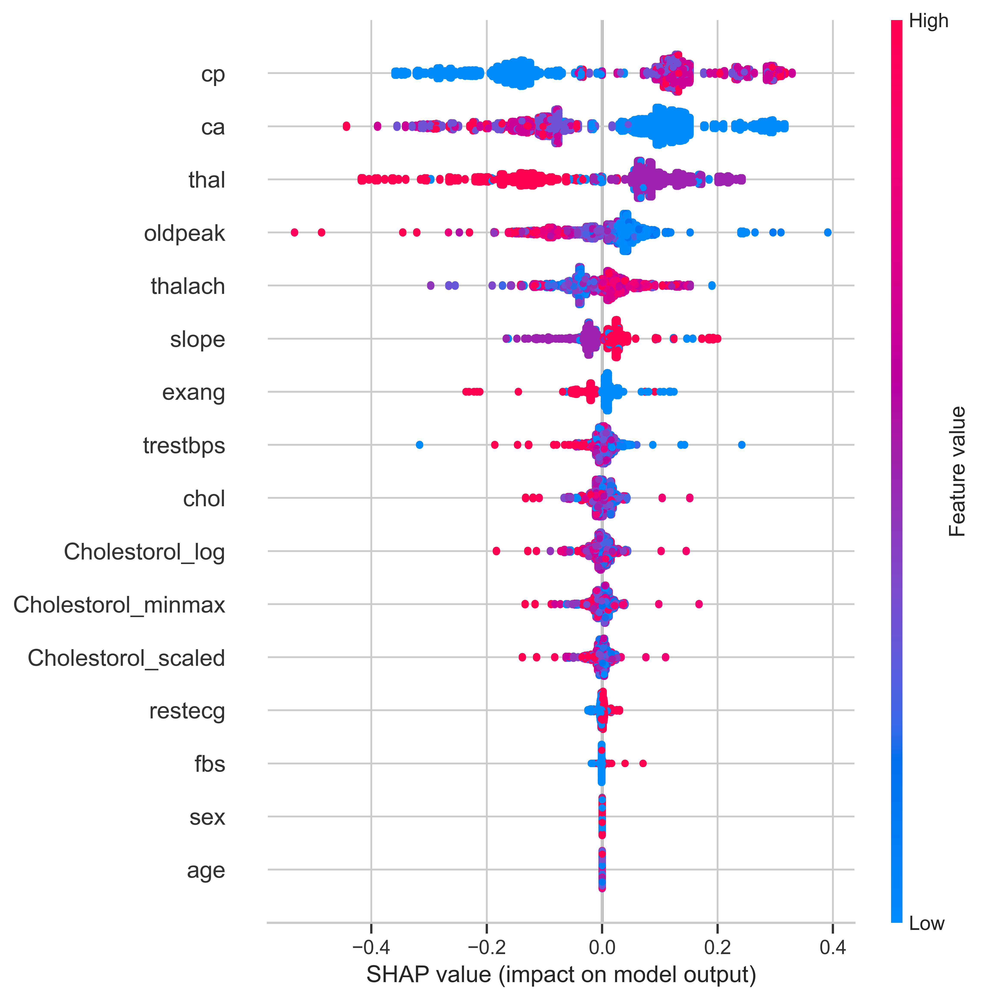

<h1 align="center">🩺 HypeXAI: Real-Time Explainable AI for Hypertension Prediction</h1>

<p align="center">
  
</p>

<p align="center">
  <i>Bridging high-accuracy AI with medical transparency for hypertension diagnosis</i>
</p>

---

## 📖 About the Project

**HypeXAI** is an intelligent, real-time medical diagnostic framework that leverages **ensemble machine learning** and **explainable AI (XAI)** to detect hypertension with unmatched accuracy and clarity. This project is based on the research paper:

> **HypeXAI: A Real-Time Explainable AI Framework for Accurate Hypertension Prediction**  
> _Pijush Kanti Roy Partho, Pankaj Bhowmik_  
> Hajee Mohammad Danesh Science and Technology University, Dinajpur, Bangladesh  
> 📧 pijushkantiroy2040@gmail.com | pankaj.cshstu@gmail.com

---

## 🧠 Key Features

- ✅ **Perfect Accuracy**: Voting Classifier, Random Forest, and Decision Tree achieved **100% accuracy** on clinical data
- ⚡ **Real-Time Service**: Lightweight Flask API for instant predictions
- 📊 **Explainability**: SHAP visualizations to explain the model's reasoning
- 📁 **Dataset**: Based on 26,083 Kaggle samples with 14 clinical features
- 🩺 **Healthcare-Driven**: Designed for early diagnosis & clinical integration

---

## 🧬 Methodology Overview

1. **Data Preprocessing**: Cleaning and normalizing clinical records
2. **Model Development**: Ensemble learners (Voting, RF, DT) and comparisons with SVM & GB
3. **Interpretability**: SHAP (SHapley Additive Explanations) to identify risk drivers
4. **Deployment**: Flask-based web interface for real-time use

---

## 📈 Results & Visualizations

### 🔹 ROC Curve

<p align="center">
  
</p>

### 🔹 Real-Time Prediction Interface

<p align="center">
  
</p>

### 🔹 SHAP Decision Plot

<p align="center">
  
</p>

### 🔹 SHAP Summary Plot

<p align="center">
  
</p>

---

## 🧰 Tech Stack

- **Programming**: Python 3.9+
- **ML Libraries**: Scikit-learn, SHAP
- **Visualization**: Matplotlib, Seaborn
- **Web Framework**: Flask

---

## 🚀 Getting Started

```bash
git clone https://github.com/yourusername/HypeXAI.git
cd HypeXAI
pip install -r requirements.txt
python app.py
```
