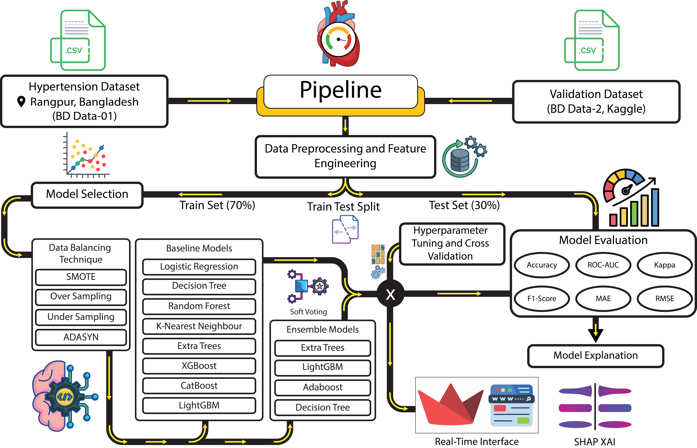
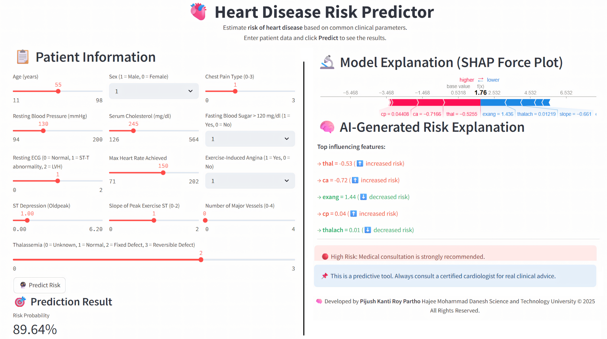
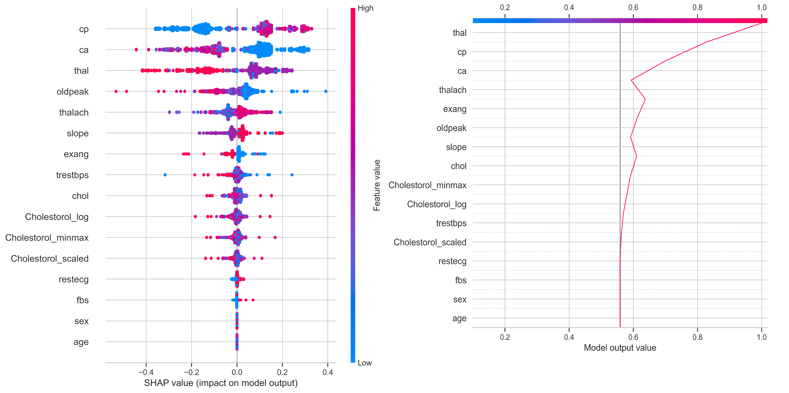

<h1 align="center">🩺 HypeXAI: Real-Time Explainable AI for Hypertension Prediction</h1>

<p align="center">
  
</p>

<p align="center">
  <i>Bridging high-accuracy AI with medical transparency for hypertension diagnosis</i>
</p>

---

## 📖 Project Overview

**HypeXAI** is a real-time, intelligent diagnostic system that utilizes **ensemble machine learning models** along with **explainable AI (XAI)** to accurately predict hypertension. This tool is designed for integration into clinical settings, delivering both precision and transparency in diagnosis.

---

## 🧠 Key Features

- ✅ **Exceptional Accuracy**: Decision Tree, Random Forest, and Voting Classifier achieved **100% accuracy**
- ⚡ **Real-Time Predictions**: Fast and responsive Flask API for real-time hypertensive state analysis
- 🧬 **Explainable Insights**: Uses XAI techniques to provide transparent, interpretable decisions
- 📊 **Feature-Rich Dataset**: Trained on a clinical dataset with **26,083 samples** and **14 attributes**
- 🩺 **Healthcare-Focused**: Built for proactive hypertension screening and digital health integration

---

## 🧾 Clinical Features Used

| Feature    | Description                                                        |
| ---------- | ------------------------------------------------------------------ |
| `age`      | Age of the patient                                                 |
| `sex`      | Gender (1 = male, 0 = female)                                      |
| `cp`       | Chest pain type                                                    |
| `trestbps` | Resting blood pressure                                             |
| `chol`     | Serum cholesterol in mg/dl                                         |
| `fbs`      | Fasting blood sugar > 120 mg/dl                                    |
| `restecg`  | Resting electrocardiographic results                               |
| `thalach`  | Maximum heart rate achieved                                        |
| `exang`    | Exercise induced angina                                            |
| `oldpeak`  | ST depression induced by exercise                                  |
| `slope`    | Slope of the peak exercise ST segment                              |
| `ca`       | Number of major vessels colored by fluoroscopy                     |
| `thal`     | Thalassemia status                                                 |
| `target`   | Diagnosis of hypertension (1 = hypertensive, 0 = non-hypertensive) |

---

## 🧪 Model Performance

| Model             | Accuracy | ROC-AUC | Precision | Recall | F1-Score |
| ----------------- | -------- | ------- | --------- | ------ | -------- |
| Decision Tree     | 1.0000   | 1.0000  | 1.0000    | 1.0000 | 1.0000   |
| Random Forest     | 1.0000   | 1.0000  | 1.0000    | 1.0000 | 1.0000   |
| SVM               | 0.9990   | 0.9990  | 0.9980    | 0.9990 | 0.9990   |
| Gradient Boosting | 0.9760   | 0.9740  | 0.9630    | 0.9940 | 0.9780   |
| AdaBoost          | 0.8850   | 0.8820  | 0.8850    | 0.9090 | 0.8970   |
| Voting Classifier | 1.0000   | 1.0000  | 1.0000    | 1.0000 | 1.0000   |

---

## 🚦 App Walkthrough

### 🔹 Framework Overview

<p align="center">
  
</p>

### 🔹 Real-Time Prediction Server

<p align="center">
  
</p>

### 🔹 SHAP Interpretability Visual

<p align="center">
  
</p>

---

## 🧰 Tech Stack

- **Programming Language**: Python 3.9+
- **ML Libraries**: Scikit-learn, SHAP
- **Visualization**: Matplotlib, Seaborn
- **Frameworks**: Flask (for API), Streamlit (for UI)

---

## ⚙️ Prerequisites

- Python >= 3.9
- pip installed
- Recommended to use a virtual environment

---

## 🚀 Getting Started

```bash
git clone https://github.com/yourusername/HypeXAI.git
cd HypeXAI
pip install -r requirements.txt
python app.py
```

---

## 👨‍💻 Authors & Contact

**Pijush Kanti Roy Partho**, **Pankaj Bhowmik**  
Hajee Mohammad Danesh Science and Technology University, Dinajpur, Bangladesh  
📧 pijushkantiroy2040@gmail.com | pankaj.cshstu@gmail.com

---

## 📄 Citation

If you use this work in your research or project, please cite the original paper:

> **HypeXAI: A Real-Time Explainable AI Framework for Accurate Hypertension Prediction**  
> _Pijush Kanti Roy Partho, Pankaj Bhowmik_  
> Hajee Mohammad Danesh Science and Technology University, Dinajpur, Bangladesh
